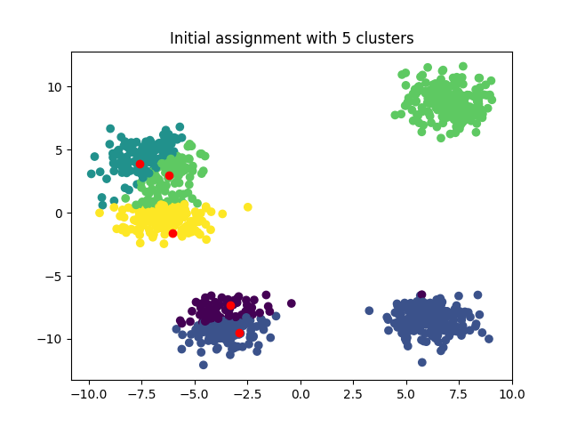
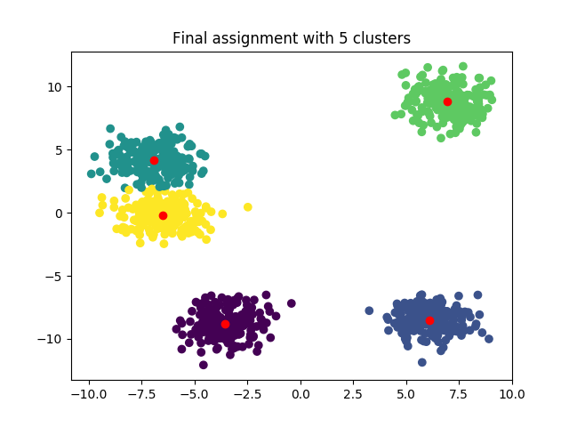

Implementation of the K-means algorithm using numpy library. The data points are generated randomly in a 2D plane to 
make it easier to visualize. The visualizations include the initial assignment, final assignment, and a graph of cost vs.
number of iterations. An example is provided below with 5 clusters. \
Initial clusters which are chosen at random: \
  

Final clusters assignment: 

 

One disadvantage of the vanilla K-means algorithm is that it can get stuck at local minima due to poor initialization. 
To address this issue, I have also included an implementation K-means++, which offers better initial centroids and helps
reduce the issue of local minima. Note that K-means++ does not guarantee the optimal assignment, and multiple runs are needed 
to obtain the optimal one. 
